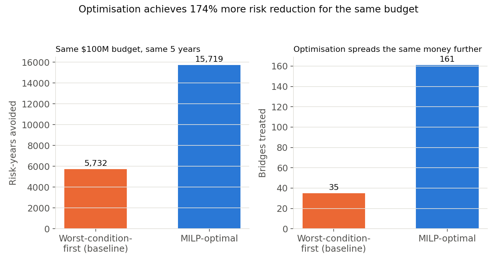
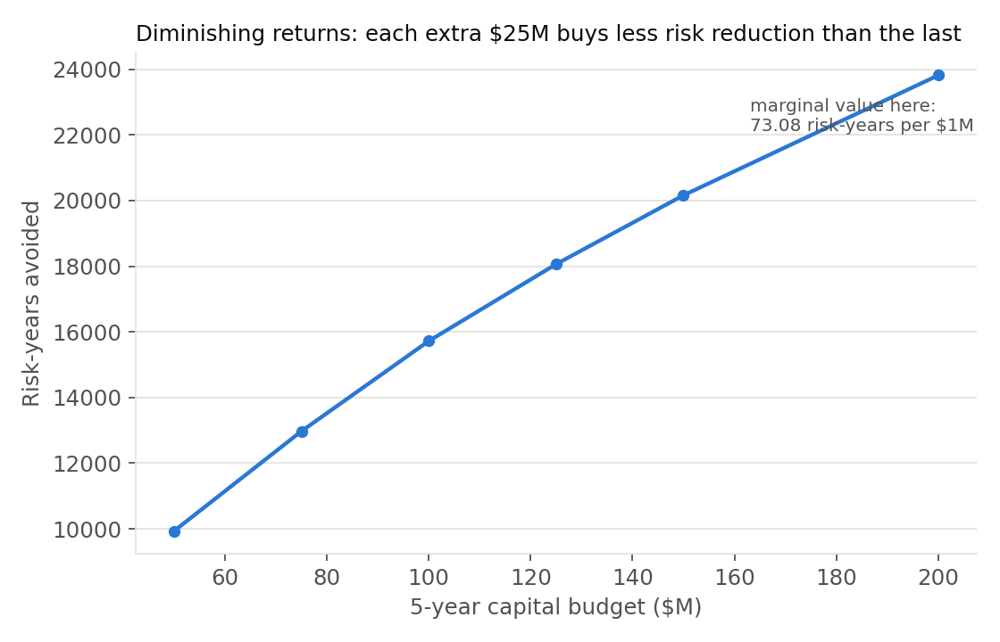
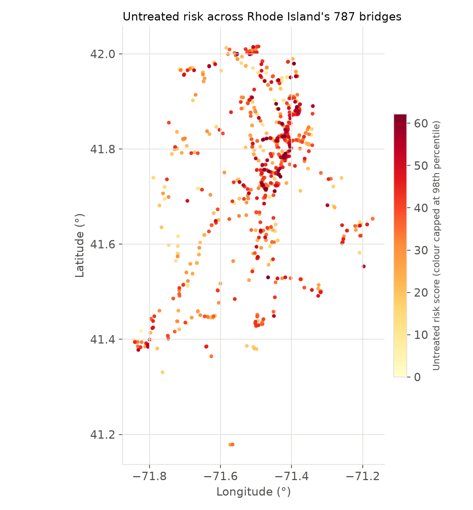
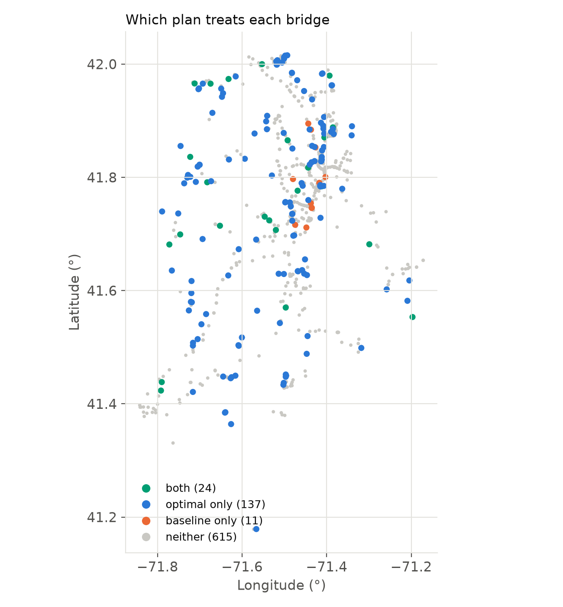
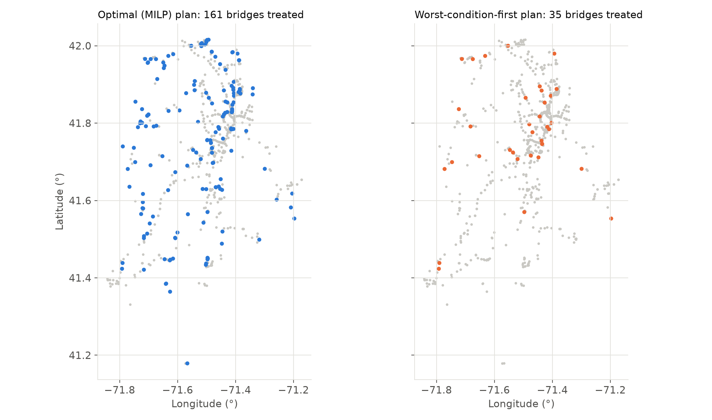
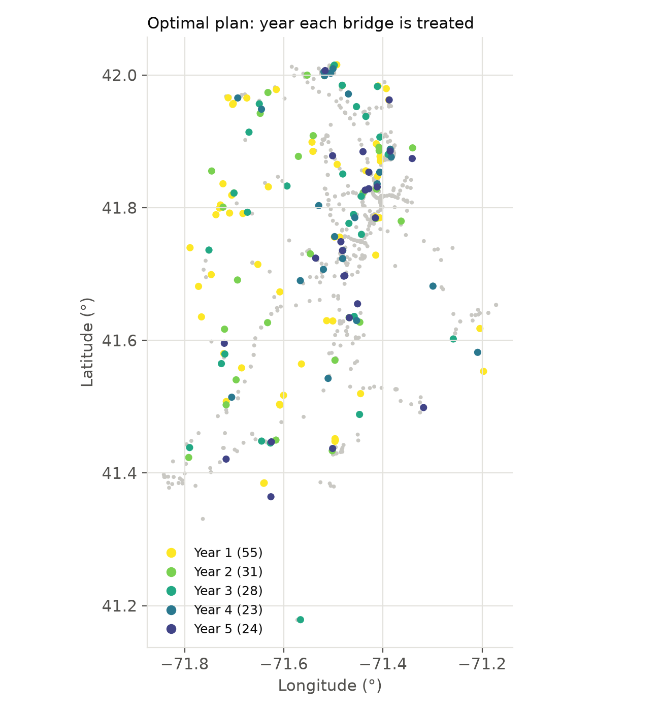

# Bridge Renewal Investment Planning

A highway agency has a fixed amount of money to spend over several years repairing
ageing bridges, and cannot fix them all. This project works out which bridges to
rehabilitate, and in which year, so that the road network carries as little risk as
possible while the work is done. It also measures how much extra benefit another
$1M of budget would buy.

## The problem

Every bridge is different. Some are in much worse condition than others. Some carry
tens of thousands of vehicles a day and some carry a few hundred. Some are large and
expensive to work on and some are small and cheap. A limited budget cannot cover
everything, so the agency has to choose.

A sensible-sounding way to choose is to fix the worst-rated bridges first. The
problem is that this ignores cost and traffic: it can spend the whole budget on a
few huge, expensive, badly-rated bridges and leave many cheaper bridges untouched
that together would have removed far more risk.

This project treats the choice as an optimisation problem instead, and compares the
result against the fix-the-worst-first rule.

## Motivation

This project comes out of the third-year mathematical programming module on my MORSE
BSc at Southampton. That course covered solving linear programmes with the simplex
and dual simplex methods and with interior point methods, handling convex problems
through KKT conditions, and solving integer problems with branch and bound and
knapsack methods, along with the idea of shadow prices. Here I extend that material:
I taught myself binary integer programming, the CBC solver, and the PuLP modelling
library from a Medium article on linear programming in Python, and applied them to a
real asset-investment decision. It is also an exercise in one of the many kinds of
problem a data scientist can be asked to solve.

## Data

The bridge data is the Federal Highway Administration's National Bridge Inventory,
2025 delimited extract for Rhode Island: 787 bridges, each with a condition rating, a
traffic count, and deck geometry. The cost rates are the FHWA's published 2024 bridge
replacement unit costs.

## How risk is scored

Each bridge gets a risk score built from two things:

- **Condition.** The inventory rates each bridge from 9, meaning new, down to 0,
  meaning failed. A worse rating gives a higher score.
- **Traffic.** A busy bridge matters more than a quiet one. Traffic counts vary
  enormously between bridges, so they are put on a compressed scale before use,
  otherwise a handful of motorway bridges would swamp everything else.

The score is condition multiplied by traffic, so a bridge scores high only if it is
both in poor condition and well used. A crumbling bridge on a quiet lane scores low,
and so does a perfect bridge on a motorway.

Rehabilitating a bridge is assumed to bring its condition back up to "very good", one
step below new, so its score drops but does not reach zero. The fall in score is the
risk reduction that rehabilitation buys for that bridge.

## How cost is estimated

The cost of working on a bridge is its deck area multiplied by a cost per square
foot, taken from the FHWA's 2024 replacement unit rates. Bridges on the main national
highway network use a higher rate than the rest. This treats every job as a full
replacement, which is deliberately on the high side, since in practice many bridges
would need less work than that. It keeps the cost figures consistent and
conservative.

## The optimisation method

For every bridge and every year of the plan there is one yes/no decision:
rehabilitate that bridge in that year, or not. Each decision is a variable that can
only take the value 0 or 1, and the objective and every constraint are linear in
those variables. A model with this shape, linear with variables restricted to 0 or 1,
is a **binary integer program**, or BIP. Because the budget is split across several
years and the model combines these 0/1 decisions with linear budget arithmetic, it is
also called a **mixed-integer linear program**, or MILP.

The objective is to minimise total risk-years: each bridge's risk score, added up
over every year of the plan that it still carries that risk. A bridge rehabilitated
early has its risk removed for more of the remaining years than one rehabilitated
late, so the model naturally treats the high-value bridges as early as the budget
allows. The constraints are that spending in any year cannot exceed that year's
budget, and that a bridge is rehabilitated at most once.

The model is built with PuLP and solved with CBC. An integer program cannot be solved
by the simplex method alone, because simplex would hand back a solution with
fractional decisions such as "rehabilitate 0.4 of a bridge". CBC uses **branch and
bound**. It first solves the relaxed problem in which the decisions are allowed to be
fractional, which is fast and gives a bound on the best result that is possible. It
then repeatedly splits the problem by forcing one fractional variable to 0 on one
branch and to 1 on the other, and discards any branch whose bound shows it cannot
beat the best whole-number solution found so far. At full size the model has 787
bridges over 5 years, close to 4,000 binary variables. Proving that a solution is
exactly optimal can take a very long time even after a good solution has been found,
so CBC is allowed to stop once it is provably within 1% of the best possible. This is
standard for a problem of this size, and every result is reported with the gap it was
solved to.

## What an extra dollar of budget is worth

This is answered two ways.

The first is the **shadow price** from the relaxed problem: the dual value on each
year's budget constraint when the decisions are allowed to be fractional. It is the
marginal value of one more dollar of budget in that year. Because allowing fractional
decisions can only ever help, this is a best case, an upper bound on what a real
dollar could be worth. For year one it works out at about 190 risk-years per extra
$1M, and it is lower in later years because a dollar spent later has fewer years left
to pay back.

The second is the **empirical value**: solve the real integer model at a range of
budget levels and measure how much extra risk reduction each step up actually
delivered. Near the $100M level this comes out at about 110 risk-years per extra $1M,
below the relaxed-problem bound, exactly as the theory says it must be, because in
reality a bridge cannot be part-funded.

## The comparison baseline

The optimised plan is compared against a simple rule an agency might realistically
use: rank the bridges from worst condition to best, and fund them in that order until
each year's budget runs out. This rule looks at condition only, and ignores both cost
and traffic.

## Results

All figures use a $100M budget spread evenly over 5 years.

| Approach | Bridges rehabilitated | Risk-years avoided |
|---|---|---|
| Worst-condition-first rule | 35 | 5,732 |
| Optimisation | 161 | 15,719 |

The same optimisation, run at a range of budgets:

| 5-year budget | Bridges treated | Risk-years avoided | Extra risk-years per additional $1M |
|---|---|---|---|
| $50M | 102 | 9,931 | — |
| $75M | 132 | 12,971 | 122 |
| $100M | 161 | 15,719 | 110 |
| $125M | 191 | 18,061 | 94 |
| $150M | 214 | 20,159 | 84 |
| $200M | 248 | 23,813 | 73 |

### Headline results

For the same $100M and the same 5 years, the optimisation avoids **174% more risk**
than the worst-condition-first rule, 15,719 risk-years against 5,732, and it does
this while rehabilitating **161 bridges instead of 35**. The rule spends most of the
budget on a small number of large, expensive, badly-rated bridges. The optimisation
instead finds many smaller bridges that each remove more risk per dollar, and gets
far more out of the same money.

More budget always helps, but each increment helps less than the one before. The
first $25M above $50M buys about 122 risk-years for every $1M; the step from $150M to
$200M buys about 73. The most cost-effective bridges are funded first, so every later
tranche of money goes on weaker options.

The two measures of a dollar's value agree in direction and differ in size as
expected. The relaxed-problem shadow price for year one is about 190 risk-years per
$1M. The real integer-constrained value near $100M is about 110. The difference is
the price of not being able to fund a fraction of a bridge.





On the map (see "Where the money goes" below), the two plans overlap on only 24
bridges. The optimal plan spreads its spending across the five counties roughly in
proportion to each county's share of the risk, while the worst-condition rule puts
41% of its budget into Kent, which holds 15% of the risk.

## Where the money goes

The optimisation says which bridges to fix. This section asks a different question
about the same two plans: **where on the map does each one spend the money, and where
is the risk that is left over?**

### How the coordinates were decoded

The inventory does not store latitude and longitude as decimal degrees. It stores them
as fixed-width digit strings: latitude is 8 digits `DDMMSSss` and longitude is 9
digits `DDDMMSSss`, where the last two digits are hundredths of a second. For example
latitude `41302330` is 41 degrees, 30 minutes, 23.30 seconds, which is 41.50647, and
longitude `071193090` is 71 degrees 19 minutes 30.90 seconds west, which is
-71.32525. A string of the wrong length, or with a non-digit in it, would decode to
the wrong place without any error, so the decoder rejects anything that is not exactly
the right number of digits (and any minutes or seconds of 60 or more). All 787 bridges
decoded, and every point falls inside a box around Rhode Island. The
decoded points are joined to the scored bridge table on the structure number, treated
as text (some have leading zeros or stray spaces), giving
`data/processed/bridges_geo.csv`. County names are added by me from the FIPS codes
(001 Bristol, 003 Kent, 005 Newport, 007 Providence, 009 Washington); the inventory
file only contains the code.

Distances are measured in metres in a projected coordinate system (UTM zone 19N,
EPSG:32619), not in degrees, because a degree of longitude is shorter than a degree of
latitude at this latitude, so distances in degrees would be distorted.

### Which plan treats which bridge

The two plans overlap on only 24 bridges. The optimal plan treats 137 more that the
baseline does not, and the baseline treats 11 that the optimal plan does not. The
other 615 are treated by neither.



*Untreated risk score of every bridge. Colour is capped at the 98th percentile.*



*Green: both plans (24). Blue: optimal only (137). Orange: baseline only (11). Grey:
neither (615).*



*The same picks drawn separately for each plan, over the untouched bridges in grey.*



*Year of treatment in the optimal plan: 55, 31, 28, 23 and 24 bridges in years 1 to 5.*

An interactive version, with a popup for every bridge and a switch for each plan, is
in `figures/bridge_plan_map.html`. It needs an internet connection: the map tiles and
the JavaScript libraries it uses are loaded from public servers.

### County shares

Share of each plan's spend, against the county's share of all untreated risk:

| County (bridges) | Share of untreated risk | Optimal: share of spend | Baseline: share of spend |
|---|---|---|---|
| Providence (480) | 61.6% | 62.9% | 54.5% |
| Washington (145) | 17.0% | 20.4% | 2.6% |
| Kent (115) | 15.3% | 11.9% | 41.2% |
| Newport (37) | 4.9% | 3.5% | 0.3% |
| Bristol (10) | 1.2% | 1.3% | 1.3% |

The optimal plan's spend is spread roughly in line with where the risk is: every
county is within 3.5 percentage points. The largest gaps are Washington, 3.5 points
above its share of the risk (20.4% of spend against 17.0%), and Kent, 3.4 points below
(11.9% against 15.3%). The worst-condition rule puts 41.2% of its spend into Kent, on
11 bridges, and 2.6% into Washington. Because the baseline treats only 35
bridges, a few expensive ones dominate these shares. The full table, including risk
reduction per county, is in `data/processed/spatial_summary.csv`.

### Is the risk clustered?

Moran's I measures whether bridges with high values tend to sit near other bridges
with high values. Here "near" means the 8 nearest bridges by distance in metres, each
weighted equally. A value of 0 means no pattern, and the value expected under no
pattern here is -0.001. A value of 1 would mean perfect clustering. The p-value comes
from shuffling the values among the bridges 999 times and counting how often a shuffle
looks at least as clustered as the real data. 0.001 is the smallest value that 999
shuffles can give.

| Risk | Moran's I | p |
|---|---|---|
| Untreated | 0.082 | 0.001 |
| Remaining after the baseline plan | 0.088 | 0.001 |
| Remaining after the optimal plan | 0.202 | 0.001 |

All three are clustered more than chance would give, but weakly. After the optimal
plan the remaining risk is more clustered (0.202) than it was before (0.082). This
says that high-risk bridges tend to have high-risk neighbours; it does not say where
the clusters are or why they exist.

### Where is the leftover risk?

Taking the 79 bridges (10%) with the highest remaining risk after each plan and
grouping those that lie close together (DBSCAN, at least 5 bridges within 3,000 m):

| Plan | Clusters | Cluster sizes | Bridges not in a cluster |
|---|---|---|---|
| Optimal | 1 | 54 | 25 of 79 |
| Baseline | 2 | 49 and 5 | 25 of 79 |

The 3,000 m distance was chosen by me after comparing 2,000, 3,000 and 5,000 m. At
2,000 m the groups split into smaller pieces (5 clusters for the optimal plan, 3 for
the baseline) and at 5,000 m they merge (2 clusters for each plan, with 13 and 16
bridges unclustered). All three are in `spatial_summary.csv`. At 3,000 m and 5,000 m the
two plans leave a similar picture: one large group holding most of the 79 bridges
(54 and 57 for the optimal plan, 49 and 51 for the baseline). The 2,000 m result is
more fragmented.

### What this does and does not show

- It describes where each plan puts the money. It does not explain why the risk is
  where it is, and a county share is not a fairness verdict.
- One small state with five counties, so the county table is coarse; Bristol has 10
  bridges.
- The spatial statistics use straight-line distance between bridges, not distance
  along roads. Coordinates are as recorded in the inventory.
- The choice of 8 neighbours is a common default and was not tested against other
  values, and the choice of 3,000 m for the hotspot grouping is a judgement call.
- Risk reduction in the county table is the one-off reduction per treated bridge, so
  it is a different measure from the risk-years in the headline results above.

## How to run

```bash
pip install -r requirements.txt
python -m src.run_all        # raw data -> scored bridges, optimised plan, baseline, budget sweep
                             # then decoded coordinates and the spatial statistics
python -m pytest tests/ -v   # 42 tests
python -m src.make_figures   # regenerate the figures above, including the maps
```

## Where this is going

- **Cost model refinement.** Every job is currently costed as a full replacement. A
  better model would scale the cost with the actual scope of work, from a deck
  overlay up to a full rebuild.
- **Degradation over time.** An untreated bridge's risk is held constant across the
  plan. A fuller model would let condition, and so risk, worsen year on year without
  intervention, which would likely make the case for early treatment stronger still.
- **Uncertainty.** Condition ratings and costs are treated as fixed numbers with no
  error bars. Adding uncertainty and testing how robust the plan is to it is a
  natural next step.
